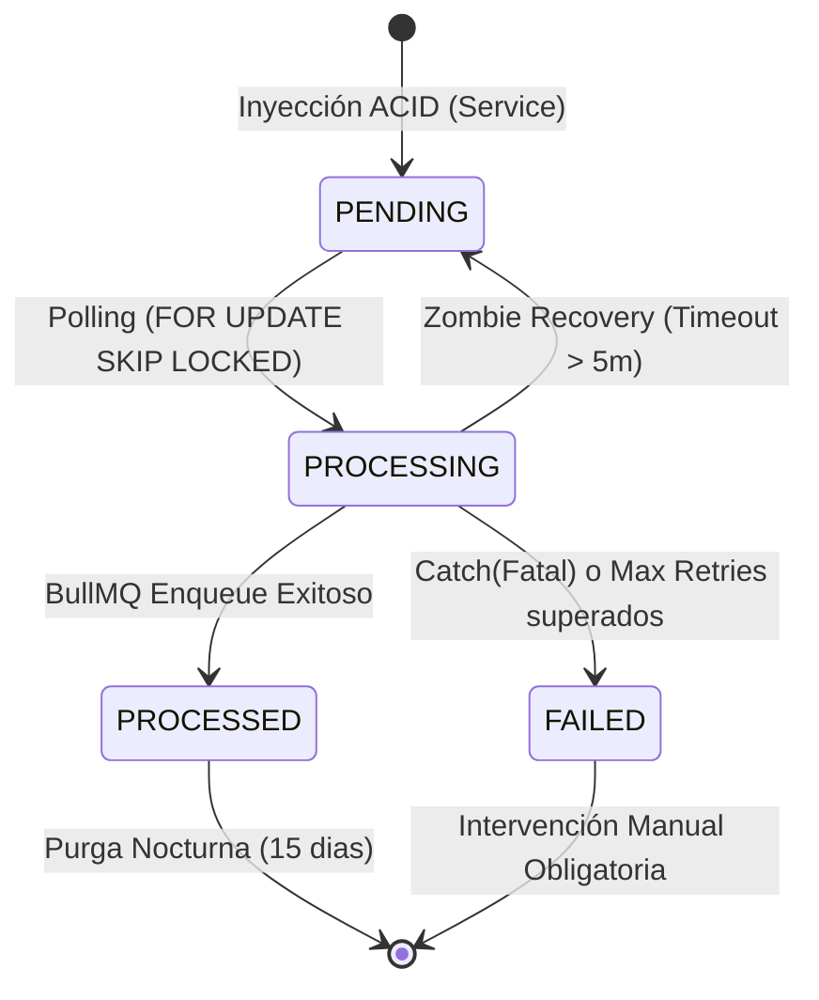

# Arquitectura del Outbox Relay v1 (Enterprise Distributed Layer)

## 1. Arquitectura del Proceso

El Relay operará como una **NestJS Standalone Application**.
**Motivación Técnica:**
- **Aislamiento de Recursos:** El polling continuo en base de datos y la comunicación con Redis (BullMQ) no deben competir por el Event Loop, la CPU ni la memoria del API HTTP principal que sirve a los tenants.
- **Tolerancia a Fallos Independiente:** Si el API tier colapsa, el Worker tier sigue procesando eventos (y viceversa).
- **Escalabilidad Asimétrica:** Permite escalar N instancias del Worker independientemente del tráfico HTTP.

---

## 2. Máquina de Estados (FSM) Inquebrantable



**Regla de Oro:** `FAILED` no se auto-reintenta. Es un estado terminal de cuarentena (Dead Letter Queue DB-side) que requiere corrección del bug subyacente.

---

## 3. Algoritmo de Polling Determinista (Anti Race-Conditions)

Para asegurar el **Exactly-Once enqueue attempt** y prevenir lecturas concurrentes del mismo evento en entornos multi-nodo, el polling se ejecutará en dos etapas transaccionales diferenciadas.

### Etapa 1: Lock & Mutate (Intrabatch Transaction)
```typescript
// Pseudo-código Arquitectónico
await tx.$executeRaw`
  WITH locked_events AS (
    SELECT id FROM "domain_event_outboxes"
    WHERE status = 'PENDING'
    ORDER BY created_at ASC
    LIMIT 100
    FOR UPDATE SKIP LOCKED
  )
  UPDATE "domain_event_outboxes"
  SET status = 'PROCESSING', locked_at = NOW()
  WHERE id IN (SELECT id FROM locked_events)
  RETURNING *;
`;
// La transacción hace commit aquí. 
// DB suelta el lock de fila, pero el row ya dice 'PROCESSING'.
```

### Etapa 2: Idempotent Enqueue
```typescript
// Fuera del commit de la Etapa 1:
for (const event of lockedEvents) {
  try {
     await bullQueue.add('EnergyAuditValidated', event.payload, {
         jobId: event.payload.eventId, // <-- CRÍTICO: Garantía de idempotencia en Redis
         removeOnComplete: false,
         attempts: 5,
         backoff: { type: 'exponential', delay: 5000 }
     });
     
     // Marcado final en DB (Individual o Bulk)
     await markAsProcessed(event.id);
  } catch (error) {
     // Si BullMQ explota (Ej: Redis de baja temporal)
     // El evento queda atrapado en 'PROCESSING'. Esperará al Zombie Recovery.
  }
}
```

**Manejo de Crashes:** Si Node muere *justo después de Etapa 1 pero antes del enqueue*, los eventos quedan huérfanos en `PROCESSING`. Para eso existe el Mecanismo Anti-Zombie.

---

## 4. Zombie Recovery Strategy

Un **CronJob paralelo** residente en la Standalone App.
- **Frecuencia:** Cada 1 minuto.
- **Acción (Raw SQL para eficiencia):**
```sql
UPDATE "domain_event_outboxes"
SET status = 'PENDING',
    locked_at = NULL,
    retry_count = retry_count + 1
WHERE status = 'PROCESSING'
  AND locked_at < NOW() - INTERVAL '5 minutes'
  AND retry_count < 10; 

-- Eventos crónicos que no reviven van a FAILED
UPDATE "domain_event_outboxes"
SET status = 'FAILED'
WHERE status = 'PROCESSING'
  AND locked_at < NOW() - INTERVAL '5 minutes'
  AND retry_count >= 10;
```

---

## 5. Simulación de Riesgos y Mitigaciones (Stress Test Mental)

| Escenario Crítico | Reacción del Sistema | Mitigación Implementada |
| :--- | :--- | :--- |
| **3 Instancias del Relay Corriendo** | Ninguna lee el mismo evento simultáneamente. | `FOR UPDATE SKIP LOCKED` a nivel PostgreSQL resuelve contención de forma nativa sin Deadlocks. |
| **Node.js Crash *mid-enqueue*** | El evento no llega a BullMQ. Queda `PROCESSING` temporalmente. | Pasan 5 min, Zombie Recovery lo pasa a `PENDING`. Otro Node vivo lo hace poll. |
| **BullMQ Envía + Crash antes de PROCESSED** | BullMQ recibe (jobId en Redis ok). DB queda `PROCESSING`, luego Zombie lo pasa a `PENDING`. Node lee de nuevo y re-envía a BullMQ. BullMQ lo **Ignora/Descarta** porque reconoce el `jobId` repetido. Worker marca PROCESSED. | `jobId = eventId` y Consumer Idempotency de Huella (DB `UNIQUE(event_id)`). |
| **Caída de BullMQ (Redis Offline)** | Queue genera exception de socket. Relay falla enqueue. | Eventos se amontonan seguros en Tablas `PENDING` o reciclan en `PROCESSING`. Tolerancia sin pérdida de payload. |
| **1 Millón de Eventos Históricos** | No hay decaimiento de performance en polling. | Índice compuesto `@@index([status, createdAt])` limita scope del b-tree inmediatamente al top de `PENDING`. Las purgas de 15 días evitan inflacion de disco. |

---

## 6. Telemetría y Observabilidad (Estructurada)

Prohibido el uso de `console.log()` en modo string interpolation. El log del Worker será JSON standard para indexado en DataDogs/Grafana.

```json
{
  "level": "info",
  "component": "OutboxRelay",
  "action": "outbox_transition",
  "eventId": "eeccbbee-...",
  "tenantId": "uu88... ",
  "from_status": "PENDING",
  "to_status": "PROCESSED",
  "duration_ms": 120,
  "queue_latency_ms": 40,
  "timestamp": "2026-03-03T23:55:00Z"
}
```

---

### Veredicto Arquitectónico Final
**✔ Diseño List para Codificación.** 

Todas las vulnerabilidades de la topología distribuida (Dual Writes, Race Conditions, Mensajes Zombis y Dead Letters) han sido contrarrestadas estáticamente en base de datos e idempotencia concurrente.
